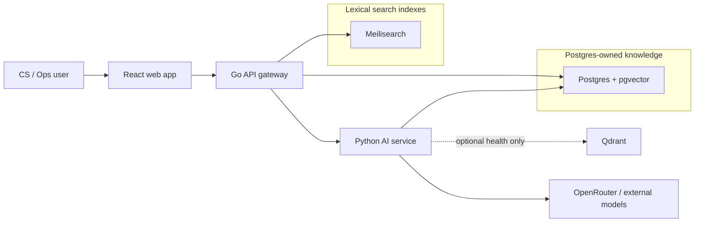
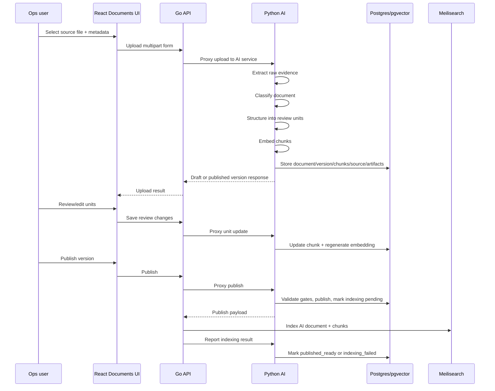
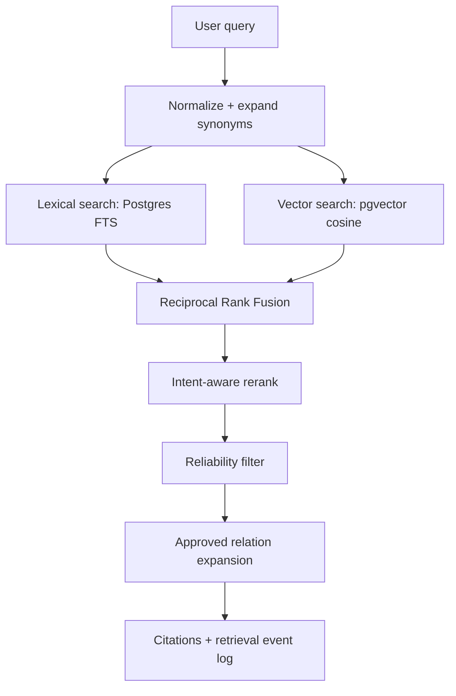

# CS KB MVP Architecture

This document is the engineering deep dive for the current project. It is written for a new engineer who needs to understand how the system behaves at runtime, especially:

- how uploaded documents become searchable knowledge;
- how the Python AI service extracts, governs, embeds, and retrieves knowledge;
- how the Go API acts as the public gateway and search orchestrator;
- how the React web app maps to those backend capabilities.

It is intentionally not an API contract. Endpoint names appear only when they clarify a runtime boundary. For request/response details, use `docs/04-api-contract.md`.

## 1. System In One Picture

The product is an internal CS knowledge base for SOP lookup, document ingestion, retrieval, chat, workflow review, and search relevance governance.

The current implementation is a monorepo with three application services and supporting infrastructure:

```txt
apps/cs-kb-web    React + TypeScript + Vite frontend
apps/cs-kb-api    Go API gateway, SOP store, Meilisearch orchestration
apps/cs-kb-ai     Python FastAPI AI/retrieval/document-ingestion service
infra/postgres    Postgres init SQL for core schema, AI retrieval, taxonomy
docs              Product, API, retrieval, deployment, extraction notes
```

Runtime topology:



Important mental model:

- **Go API** owns the public gateway, legacy structured SOP CRUD/search, Meilisearch sync, and fallback behavior.
- **Python AI service** owns messy document ingestion, extraction pipeline, embeddings, pgvector retrieval, synonym expansion, KB index materialization, grounded chat, and publish gates.
- **Postgres** is the system of record for both legacy SOPs and AI-ingested documents.
- **Meilisearch** is a lexical accelerator, not the source of truth.
- **Qdrant** is present in Docker Compose and health checks, but current retrieval is implemented with Postgres + pgvector.

## 2. Core Service Responsibilities

### React Web

Location: `apps/cs-kb-web`

Primary responsibilities:

- Operational UI shell and navigation.
- Lookup/search experience for CS users.
- Document upload/review/publish UI for Ops users.
- Extraction unit editing.
- Retrieval lab.
- Chat workspace.
- Synonym governance.
- Relations/collections/tools/feedback dashboards.

Current routes are declared in `apps/cs-kb-web/src/router.tsx`:

- dashboard
- lookup
- chat
- case assist
- tools
- collections
- documents
- feedback
- relations
- synonyms
- retrieval lab

The frontend does not own business rules. It builds forms, manages local UI state, calls the Go API, and invalidates React Query caches after mutations.

### Go API

Location: `apps/cs-kb-api`

Primary responsibilities:

- Public API boundary for the frontend.
- Legacy structured SOP storage under `kb_sops` / `kb_sop_versions`.
- Keyword search over legacy SOPs through Meilisearch.
- Postgres fallback search for legacy SOPs if Meilisearch is unavailable.
- Proxy most AI/document/search-governance operations to Python.
- Sync published AI documents and chunks into Meilisearch.
- Report indexing results back to Python so Python can mark versions production-visible.
- Keep basic lookup available even if the Python AI service is down.

The main code paths are:

- `internal/http/handler.go`: routes, proxying, AI retrieval orchestration, indexing callbacks.
- `internal/service/store.go`: Postgres access, Meilisearch indexing/search, SOP publishing.
- `internal/model/model.go`: public Go-side DTOs.

### Python AI Service

Location: `apps/cs-kb-ai`

Primary responsibilities:

- Accept uploaded source documents.
- Extract raw evidence from files.
- Classify document type.
- Structure documents into reviewable units.
- Persist extraction pipeline artifacts for audit/debug.
- Generate embeddings for chunks.
- Store document versions and chunks.
- Enforce review and publish readiness gates.
- Run hybrid retrieval over published knowledge.
- Expand queries with governed synonyms.
- Materialize KB index workbooks into collections, issue routers, tool links, and action templates.
- Handle grounded chat over published retrieval sources.

Key files:

- `app/main.py`: FastAPI app, upload/retrieve/chat/document endpoints, pipeline inspection rendering.
- `app/ingestion.py`: upload extraction pipeline and document-type-specific structuring.
- `app/repository.py`: Postgres schema, persistence, publish gates, retrieval SQL, relations, KB index materialization.
- `app/retrieval.py`: query expansion, lexical/vector/hybrid retrieval, reranking, relation expansion.
- `app/text_processing.py`: file parsing, chunking, normalization, source extraction helpers.
- `app/openrouter.py`: model calls for extraction/refinement/chat helpers.
- `app/workflow_v3.py`: workflow graph-primary extraction support and validation helpers.
- `app/embedding.py`: embedding abstraction with local deterministic fallback.
- `app/schemas.py`: Pydantic schemas and normalizers.

## 3. Two Knowledge Domains

The project currently has two knowledge domains. This is deliberate.

### Domain A: Legacy Structured SOPs

Tables:

- `kb_sops`
- `kb_sop_versions`

Owned mostly by the Go API.

These SOPs are structured records with fields like title, summary, audience, vertical, category, tags, case reasons, and current published version sections.

Search path:

```txt
React lookup
  -> Go search handler
    -> Meilisearch index "sops"
    -> fallback to Postgres in-memory scoring if Meili fails
```

Publishing a legacy SOP updates `kb_sops.current_version_id`, archives previous versions, reindexes Meilisearch, and asks Python to index the SOP version into the AI retrieval layer.

### Domain B: AI-Ingested Documents

Tables:

- `ai_documents`
- `ai_document_versions`
- `ai_chunks`
- `ai_document_sources`
- `extraction_jobs`
- `extraction_stage_outputs`
- `ai_document_relations`
- `ai_retrieval_events`
- `ai_audit_events`
- KB index tables such as `kb_collections`, `kb_collection_items`, `tool_links`, `action_templates`

Owned mostly by the Python AI service.

This domain is for messy source files: PDF, DOCX, Excel, text, markdown, and image-like assets. It treats every uploaded file as evidence that must be extracted, reviewed, versioned, and only then made visible to production retrieval.

Production retrieval only reads chunks that satisfy strict gates:

- document is active;
- version is current;
- version status is `published`;
- publish state is `published_ready`;
- chunk `review_status` is `approved`;
- chunk `extraction_status` is `structured` or `manually_curated`;
- chunk is not `publish_blocked`.

This prevents draft, degraded, failed, archived, or unreviewed content from appearing in CS lookup/chat.

## 4. Data Lifecycle: Upload To Searchable Knowledge

This is the most important flow in the system.



### 4.1 Upload Entry

The frontend builds a multipart form from `DocumentsPage`:

- file bytes;
- external id;
- title;
- target status: usually `draft`;
- metadata: audience, vertical, category, tags, case reasons, owner team, risk level, review schedule, source marker.

Go does not parse the file. It proxies the multipart request to Python.

There are two upload modes:

- **sync upload**: extraction happens before the response returns;
- **async upload**: Python creates a draft shell with `extraction_status = extracting`, then runs extraction in a background task and replaces chunks when complete.

Async upload exists because workflow PDFs and AI extraction can be slow.

### 4.2 Raw Evidence Extraction

Python starts in `prepare_document_version()` in `app/ingestion.py`.

The first stage is evidence extraction:

- spreadsheets preserve sheets, rows, columns, hyperlinks;
- DOCX preserves paragraphs and tables;
- PDFs preserve raw text blocks and, for workflow diagrams, rendered page images and visual layout candidates;
- plain text/markdown uses text chunking;
- unsupported/failed inputs become recoverable failed drafts when possible.

The pipeline persists a `map/source_blocks` artifact that shows what the system actually saw. This is critical for debugging because extraction quality depends on source evidence quality.

### 4.3 Classification

The service classifies the document into a `document_type`.

Important types:

- `text_sop`
- `policy_rule`
- `policy_table`
- `workflow_diagram`
- `kb_index_workbook`
- `asset_sop`
- `macro_script`
- `training_material`
- `unknown`

Classification controls the rest of the pipeline. A workflow PDF and an Excel workbook follow very different extraction strategies.

The classification result is persisted as `classify/classification_result`.

### 4.4 Document-Type Branching

#### Policy Rule / Policy Table

The service prefers deterministic extraction when source structure is strong.

Example: a DOCX table that looks like a financial threshold matrix can be converted into `policy_rule` and `exception_rule` chunks without depending fully on an LLM.

If deterministic extraction is insufficient, Python calls rule-table extraction via `openrouter.py`. AI output is still normalized and treated as draft review content.

Expected unit types:

- `full_sop`
- `policy_rule`
- `exception_rule`
- `warning`
- `operational_note`
- `related_document`

#### Workflow Diagram

Workflow diagrams are the most complex branch.

For PDF workflow diagrams:

1. Render pages into images.
2. Extract visual layout candidates.
3. Build semantic refinement from visual candidates and source text.
4. Try Workflow V3 graph-primary extraction.
5. If V3 fails quality/fidelity, try V2 vision-primary extraction.
6. If V2 fails, try legacy workflow extraction.
7. If everything fails, create semantic/degraded review candidates.

Workflow V3 is graph-first:

- AI transcribes the canvas into nodes, arrows, notes, lanes, and relations.
- Deterministic compiler normalizes node IDs, step codes, edges, source refs, and annotations.
- Repair logic handles repairable defects, such as duplicate IDs or missing terminal edges when evidence supports synthesis.
- Fidelity validation checks step coverage, decision branch coverage, terminal edges, source refs, graph integrity, and annotation attachment.

The system can store V3 artifacts even if the final selected flow falls back to V2/legacy/semantic candidates. That is useful because reviewers can inspect why a candidate was rejected.

Expected workflow unit types:

- `full_sop`
- `workflow_graph`
- `workflow_step`
- `decision_point`
- `routing_rule`
- `handoff_rule`
- `sla_rule`
- `operational_note`
- `warning`
- `related_document`

Important rule: workflow topology is never auto-trusted. Human review remains mandatory.

#### KB Index Workbook

This branch converts operational Excel workbooks into navigation/index primitives.

The pipeline tries to infer:

- collections;
- issue router units;
- SOP references;
- tool links;
- action templates;
- relations;
- unresolved targets.

These become reviewable chunks first. On publish, Python materializes approved units into first-class KB tables like `kb_collections`, `kb_collection_items`, `tool_links`, and `action_templates`.

This means an Excel workbook is not just searchable text. It can reshape operational navigation in the app after review/publish.

#### Generic / Unknown Text

Generic documents are chunked into text sections and marked for review. The system may add a `full_sop` layer, but it does not assume production readiness without review.

### 4.5 AI Structuring And Fallback

For structured document types, Python may call external models through `openrouter.py`.

The service is designed to fail recoverably:

- If AI structuring fails, upload can still create a draft.
- If no usable chunks are returned, the pipeline creates degraded review candidates.
- Degraded chunks are marked as evidence-only or publish-blocked until manually curated.
- Warnings and errors are stored in metadata and pipeline artifacts.

This matters because source upload should not silently invent business policy. The system prefers a blocked draft over an unsafe answer.

### 4.6 Normalization And Refinement

After branch-specific extraction, Python normalizes units:

- canonicalizes `unit_type`;
- ensures source refs exist where possible;
- ensures a `full_sop` layer exists;
- merges metadata;
- computes source ref quality;
- sets review status;
- sets publish-blocking flags when needed;
- applies delivery refinements.

Relevant Pydantic normalizers live in `app/schemas.py`. These normalize messy model outputs into predictable internal shapes.

### 4.7 Embedding

Each chunk receives an embedding before persistence.

`app/embedding.py` supports:

- OpenRouter-compatible remote embeddings when provider/key/model are configured;
- local deterministic `local_hash` fallback for development when no remote key is configured.

The default production model is `openai/text-embedding-3-small` via `/embeddings`, reusing OpenRouter environment variables unless `EMBEDDING_*` overrides are set. The local hash embedding is intentionally deterministic and dependency-light; it keeps development and tests running without external embedding infrastructure and is not intended to be the final high-quality semantic model.

Embeddings are stored in Postgres `ai_chunks.embedding` as `vector(1536)` by default.

### 4.8 Persistence

`repository.create_document_version()` writes the upload result into Postgres:

- upsert or create `ai_documents` by `external_id`;
- create next immutable `ai_document_versions` row;
- store raw source bytes in `ai_document_sources`;
- insert chunks into `ai_chunks`;
- persist extraction jobs and stage outputs;
- detect/sync unresolved document relations;
- write audit event.

The version is immutable once published or archived. Draft chunks can be edited.

## 5. Extraction Pipeline Artifacts

Extraction pipeline artifacts are a first-class debugging feature.

They are stored in:

- `extraction_jobs`
- `extraction_stage_outputs`

The stage model is:

```txt
map
classify
workflow_semantic_refine
ai_structure
plan
reduce
refine
verify
commit
```

Common artifact types:

- `source_blocks`
- `classification_result`
- `visual_layout_blocks`
- `visual_graph_candidates`
- `workflow_semantic_refinement`
- `workflow_canvas_transcription`
- `workflow_graph_draft`
- `workflow_fidelity_report`
- `workflow_graph_repair_report`
- `source_evidence_view`
- `ai_structured_payload`
- `ai_breakdown`
- `structuring_plan`
- `reconcile_suggestions`
- `refinement_report`
- `draft_units`
- `verification_report`
- `publish_readiness_report`

When extraction looks wrong, inspect artifacts in this order:

1. `classify/classification_result`: did the document enter the right branch?
2. `map/source_blocks`: what evidence did the parser see?
3. `map/visual_graph_candidates`: did workflow visual detection see nodes/arrows?
4. `workflow_semantic_refine/workflow_canvas_transcription`: what did the vision model transcribe?
5. `workflow_semantic_refine/workflow_graph_draft`: what graph did the compiler produce?
6. `workflow_semantic_refine/workflow_fidelity_report`: why did a graph pass/fail?
7. `ai_structure/ai_breakdown`: which flow was selected and why?
8. `refine/draft_units`: what became reviewable units?
9. `verify/verification_report`: why is publish blocked?

The UI exposes inspection views through the Documents workspace.

## 6. Review And Publish Lifecycle

### 6.1 Version Status

AI document versions use:

- `draft`
- `published`
- `archived`

Publish state is separate:

- `draft`
- `publishing`
- `published_indexing_pending`
- `published_indexing_failed`
- `published_ready`
- `archived`

This distinction is important:

- `status = published` means Python accepted the version as published.
- `publish_state = published_ready` means it is fully visible to production retrieval.

A published version can be blocked from production visibility if indexing fails.

### 6.2 Editing Extraction Units

Draft chunks are review units.

When a reviewer edits a unit:

- title/content/unit type/confidence/review status/metadata are saved;
- section is updated to the chosen unit type;
- token count is recalculated;
- embedding is regenerated from edited text;
- audit event is recorded.

Published and archived versions are immutable.

If a degraded candidate is approved and converted to a real unit type, Python marks it as `manually_curated`, clears `publish_blocked`, and allows it to pass publish gates if all other conditions pass.

### 6.3 Bulk Review

Bulk review exists for speed, but it is guarded.

Without `force`, bulk review is blocked for:

- workflow diagrams;
- low-confidence units;
- high-risk content.

With force approval, degraded candidates can be promoted, but metadata records the manual curation method and actor.

### 6.4 Publish Readiness

Publish is not just status mutation. Python validates hard gates.

Common blockers:

- no extraction units;
- extraction failed validation;
- missing `full_sop`;
- missing production atomic units;
- degraded units still need manual curation;
- units still need review;
- owner team missing;
- source refs missing;
- effective date missing for high-risk policy/workflow content;
- workflow graph missing;
- workflow graph has no edges;
- workflow graph needs review;
- uncertain workflow edges are unacknowledged;
- page-only PDF source refs are not acknowledged;
- required workflow unit types are missing or unreviewed;
- unresolved required relations remain for high-risk scope.

This gate is the main safety boundary between uploaded source evidence and CS-facing answers.

### 6.5 Publishing

When Python publishes:

1. It validates readiness unless force is requested.
2. It sets publish state to `publishing`.
3. It archives previous published versions for the same document.
4. It marks this version `published`.
5. It sets publish state to `published_indexing_pending`.
6. It updates `ai_documents.current_version_id`.
7. It marks chunks approved and stamps document type into chunk metadata.
8. It materializes KB index/collection items if applicable.
9. It returns a publish payload to Go.

At this point the version is not yet production visible because `published_ready` has not been set.

### 6.6 Indexing Callback From Go

Go receives the publish payload and syncs Meilisearch:

- index document-level record into `ai_documents`;
- fetch chunks back from Python;
- index chunk-level records into `ai_chunks`;
- report result back to Python.

Python marks:

- `published_ready` if lexical index sync succeeded and vector chunks exist;
- `published_indexing_failed` otherwise.

Production retrieval requires `published_ready`.

This design avoids a subtle failure mode: a version is published in the database but not searchable in one of the search paths.

## 7. Search And Retrieval

There are two user-facing search paths.

### 7.1 Lookup Search: Go-Orchestrated Mixed Results

The normal CS lookup page calls Go search.

Go does:

```txt
1. Search legacy structured SOPs.
   Prefer Meilisearch index "sops".
   Fallback to Postgres local scoring if Meili fails.

2. If semantic search is enabled:
   call Python AI retrieval with mode = hybrid and filters.

3. Return keyword results and semantic results as separate arrays.
```

Important: Go currently does **not** fuse legacy SOP keyword results and AI semantic results into one global ranked list. It returns:

- `results`: legacy structured SOP results;
- `semantic_results`: AI-ingested document chunk results.

The frontend decides how to display those sections.

If Python AI retrieval fails, Go still returns keyword SOP results and marks the used mode as AI unavailable. This is intentional: AI downtime must not break core SOP lookup.

### 7.2 Direct AI Retrieval: Python-Owned Ranking

The retrieval lab and chat use Python retrieval more directly.

Python retrieval flow in `app/retrieval.py`:



### 7.3 Query Normalization And Synonyms

Python loads active synonym groups from Postgres with a short cache.

Synonym types include:

- regular equivalence;
- one-way expansion;
- typo correction;
- placeholder for future templated expansion.

Every retrieval response includes query expansion metadata:

- normalized query;
- expansions;
- matched synonyms;
- active synonym group count.

This makes relevance changes auditable.

### 7.4 Lexical Search

Lexical search is implemented in Postgres, not Meilisearch, for AI chunks.

It uses:

- `to_tsvector('simple', immutable_unaccent(...))`;
- `to_tsquery('simple', ...)`;
- content, section, heading, sheet name;
- accent-insensitive matching;
- structural boosts for sheet/heading matches.

Lexical search is useful for exact SOP terms, spreadsheet sheet names, policy labels, and Vietnamese operational phrases.

### 7.5 Vector Search

Vector search embeds the normalized query and compares it against `ai_chunks.embedding` using pgvector cosine distance.

The score is:

```txt
1 - cosine_distance
```

Vector search is useful when wording differs from the source document.

### 7.6 Hybrid Search

Hybrid mode runs both lexical and vector search, then merges results using Reciprocal Rank Fusion.

RRF is robust because it does not require lexical and vector scores to be directly comparable. Each source contributes based on rank position.

After RRF, Python reranks by query intent.

### 7.7 Intent-Aware Reranking

Intent reranking boosts results when query tokens overlap with metadata/content and when the unit type matches likely task intent.

Boosted action-oriented unit types include:

- `policy_rule`
- `exception_rule`
- `threshold_rule`
- `workflow_step`
- `decision_point`
- `routing_rule`
- `handoff_rule`
- `sla_rule`
- `macro_script`
- `issue_router_unit`
- `quick_action_rule`
- `tool_link`
- `warning`
- `security_note`
- `compliance_note`

Special boosts exist for prohibition/security/risk intent, such as questions about not providing IDs, ZT, security, or compliance.

### 7.8 Reliability Filter

After ranking, Python drops weak results.

Rules:

- lexical hits are accepted;
- vector-only hits need enough vector score;
- if nothing reliable remains, response includes `no_reliable_source`.

This protects chat and lookup from hallucination-like retrieval matches.

### 7.9 Relation Expansion

After retrieving top chunks, Python can append chunks from approved related documents.

Only approved relations expand production retrieval. Suggested, unresolved, rejected, archived, and possible conflict relations do not expand production retrieval.

Relation-expanded rows are clearly marked through `rank_source = approved_relation`.

## 8. Go API Search/Indexing Deep Dive

### 8.1 Go As Gateway

Most frontend traffic goes to Go. Go then decides whether to handle locally or proxy to Python.

Handled locally:

- health aggregation;
- legacy SOP list/detail/create/version/publish/archive;
- legacy SOP keyword search;
- Meilisearch sync/indexing.

Proxied to Python:

- AI documents;
- document versions/chunks/extraction units;
- publish readiness;
- AI retrieval;
- chat;
- synonym governance;
- collections/tools/action templates;
- relations;
- feedback/ops analytics.

This gives the app one public backend boundary while allowing Python to own AI-heavy logic.

### 8.2 Legacy SOP Search

Go searches the `sops` Meilisearch index first.

If Meilisearch fails:

- Go loads published SOPs from Postgres;
- applies filters;
- computes a simple normalized token score over title, tags, case reasons, summary, sections, and view count;
- sorts by confidence.

This fallback is intentionally basic but keeps SOP lookup functional.

### 8.3 AI Retrieval From Go Search

When the lookup request includes semantic search:

Go builds a Python retrieval payload:

- original query;
- mode `hybrid`;
- limit 6;
- filters for audience, vertical, category, tags, case reasons, collections, task types, unit types;
- status forced to `published`.

Python still applies its stricter production gates. Go does not try to bypass them.

Go decodes only `results` from Python retrieval for the mixed search response.

### 8.4 AI Document Indexing In Meilisearch

When Python returns a published AI document payload, Go indexes it into Meilisearch.

The index sync includes:

- `ai_documents`: document-level search card;
- `ai_chunks`: chunk-level lexical index.

Before indexing chunks, Go deletes old chunks for that document to avoid stale version hits.

Go fetches chunks from Python using the specific published version id, then writes each chunk into Meilisearch with filterable fields like:

- document id;
- version id;
- status;
- publish state;
- vertical;
- category;
- tags;
- case reasons.

Finally Go reports indexing result back to Python.

## 9. Frontend Runtime Model

The web app is organized around pages and workspaces:

- pages wire data fetching/mutations;
- workspaces render product UI;
- hooks wrap API calls;
- shared components implement shell, feedback, operations, review panels.

Important flows:

### Lookup Page

`LookupPage`:

- stores query/filter state in URL;
- calls Go search with `include_semantic = true`;
- displays legacy SOP results and semantic document matches;
- opens structured SOP detail through Go;
- can ask AI for a suggestion based on selected SOP.

### Documents Page

`DocumentsPage`:

- lists AI documents;
- selects document/version via URL params;
- previews metadata before upload;
- uploads sync or async;
- loads chunks, raw text, extraction units, pipeline artifacts, publish readiness;
- updates extraction units optimistically;
- bulk reviews units;
- publishes versions;
- archives documents.

The page is UI orchestration only. Publish rules live in Python.

### Retrieval Page

`RetrievalPage`:

- calls direct AI retrieval through Go proxy;
- supports retrieval mode selection;
- sends filters and requires published status.

This is a debug/evaluation surface for retrieval quality.

### Chat Page

Chat routes proxy to Python. Python grounds answers in retrieval results and stores chat sessions/messages/events. Model route selection is configured in the AI service.

## 10. Storage Architecture

### Postgres

Postgres is the main source of truth.

The Go API creates/uses:

- `kb_sops`
- `kb_sop_versions`

The Python service ensures/uses:

- `ai_documents`
- `ai_document_versions`
- `ai_chunks`
- `ai_document_sources`
- `ai_document_relations`
- `extraction_jobs`
- `extraction_stage_outputs`
- `ai_retrieval_events`
- `ai_chat_events`
- `ai_chat_sessions`
- `ai_chat_messages`
- `ai_audit_events`
- `taxonomy_intents`
- `search_synonym_groups`
- `search_synonym_terms`
- `search_synonym_suggestions`
- `kb_collections`
- `kb_collection_items`
- `tool_links`
- `action_templates`

Python calls `ensure_schema()` on startup, so local/dev deployments self-heal missing tables/columns. Production should still manage migrations explicitly.

### pgvector

`ai_chunks.embedding` stores vector embeddings.

An HNSW index is created for vector cosine search.

### Meilisearch

Meilisearch contains derived indexes:

- `sops`
- `ai_documents`
- `ai_chunks`

It can be rebuilt from Postgres and Python chunk data. It should not be treated as source of truth.

### Qdrant

Qdrant exists in Docker Compose and health reporting. Current retrieval code uses Postgres + pgvector. Qdrant is available for future migration or experimentation.

## 11. Safety Invariants

These are the most important correctness rules:

- Draft AI document versions are not production retrieval sources.
- Archived documents/versions are not production retrieval sources.
- Published versions are immutable.
- `published` is not enough; production retrieval needs `published_ready`.
- Chunks need `review_status = approved`.
- Chunks need `extraction_status = structured` or `manually_curated`.
- `publish_blocked` chunks do not appear.
- Degraded extraction must be manually curated before publish.
- Workflow graph topology requires human review.
- Page-only PDF source refs need acknowledgement.
- High-risk policy/workflow docs need governance metadata.
- AI answers and retrieval results must include citations.
- AI downtime should not break basic keyword SOP lookup.

## 12. Failure Modes And Expected Behavior

### AI Extraction Fails

Expected behavior:

- upload may still create a draft;
- raw evidence is preserved if extractable;
- failure artifacts are stored;
- chunks are marked degraded/evidence-only;
- publish is blocked.

This is preferable to producing unsafe searchable policy.

### PDF Render Fails

Workflow PDF extraction needs page images. If rendering is unavailable, the upload should fail recoverably or produce a blocked draft rather than a trusted graph.

### Meilisearch Fails

Legacy SOP search falls back to Postgres scoring.

AI publish indexing may fail. In that case Python marks the version `published_indexing_failed`, not `published_ready`, so production retrieval does not expose a partially indexed version.

### Python AI Service Fails During Lookup

Go still returns legacy SOP keyword results. Semantic results are omitted and used mode indicates AI retrieval unavailable.

### Embedding Provider Fails

When a remote embedding provider is configured, embedding failures are surfaced instead of silently falling back to local hash. Hybrid retrieval degrades to lexical search with an `embedding_unavailable` warning; vector-only retrieval returns no results with the same warning.

### Relation Is Unresolved

Unresolved/suggested relations do not expand production retrieval. For high-risk scopes, unresolved required/blocking relations can prevent publish.

## 13. How To Debug Common Problems

### "Upload succeeded but document is not searchable"

Check:

1. Version status.
2. Publish state.
3. Publish readiness failures.
4. Whether Go indexing callback succeeded.
5. Whether chunks have `review_status = approved`.
6. Whether chunks have `extraction_status = structured` or `manually_curated`.
7. Whether `publish_blocked` remains true.

### "Retrieval result is missing"

Check:

1. Is the document current published version?
2. Is `publish_state = published_ready`?
3. Do filters exclude it?
4. Does lexical search match after accent normalization?
5. Does vector score pass reliability threshold?
6. Is the useful content stuck in `full_sop` instead of an atomic unit?
7. Is the unit type meaningful for intent reranking?

### "Workflow graph is wrong"

Inspect:

1. source blocks;
2. visual graph candidates;
3. V3 canvas transcription;
4. V3 graph draft;
5. fidelity report;
6. repair report;
7. selected flow in AI breakdown;
8. final draft units.

Most workflow bugs are either source evidence quality issues, node/edge transcription issues, or flow-selection quality gates.

### "Publish is blocked"

Use publish readiness and map failures to gates:

- missing full SOP;
- unit review incomplete;
- missing source refs;
- degraded units not converted;
- workflow graph/edge review incomplete;
- owner/effective date/review schedule missing;
- unresolved required relations.

## 14. Local Runtime

Docker Compose starts:

- web on `3000`;
- Go API on `8080`;
- Python AI on `8090`;
- Postgres on `5432`;
- Meilisearch on `7700`;
- Qdrant on `6333`.

Important environment variables:

- Go:
  - `DATABASE_URL`
  - `MEILI_HOST`
  - `MEILI_MASTER_KEY`
  - `AI_BASE_URL`
  - `SEED_DEMO_SOPS`
  - `LOG_LEVEL`
- Python:
  - `DATABASE_URL`
  - `OPENROUTER_API_KEY`
  - `OPENROUTER_MODEL`
  - `OPENROUTER_REFINE_MODEL`
  - `OPENROUTER_VISION_MODEL`
  - `EMBEDDING_PROVIDER`
  - `EMBEDDING_BASE_URL`
  - `EMBEDDING_API_KEY`
  - `EMBEDDING_MODEL`
  - `EMBEDDING_DIMENSIONS`
  - `QDRANT_URL`

Default local embeddings do not require external keys. Production embeddings reuse `OPENROUTER_API_KEY` and `OPENROUTER_BASE_URL` when `EMBEDDING_API_KEY` or `EMBEDDING_BASE_URL` are empty.

## 15. Code Reading Guide

Start here:

1. `README.md`: service list and quick start.
2. `docker-compose.yml`: runtime topology.
3. `apps/cs-kb-api/internal/http/handler.go`: public request routing and proxy boundaries.
4. `apps/cs-kb-api/internal/service/store.go`: Go Postgres/Meilisearch behavior.
5. `apps/cs-kb-ai/app/main.py`: Python entrypoints and pipeline inspection.
6. `apps/cs-kb-ai/app/ingestion.py`: upload-to-units pipeline.
7. `apps/cs-kb-ai/app/repository.py`: schema, publish gates, persistence, retrieval SQL.
8. `apps/cs-kb-ai/app/retrieval.py`: ranking and retrieval behavior.
9. `apps/cs-kb-ai/app/schemas.py`: payload contracts and normalizers.
10. `apps/cs-kb-web/src/pages/documents-page.tsx`: document workflow UI orchestration.
11. `apps/cs-kb-web/src/pages/lookup-page.tsx`: lookup/search UI orchestration.
12. `apps/cs-kb-web/src/pages/retrieval-page.tsx`: retrieval lab.

For workflow extraction details, also read:

- `apps/cs-kb-ai/app/workflow_v3.py`
- `docs/13-extraction-pipeline-flow.md`

## 16. Architectural Tradeoffs

### Why Go + Python?

Go is used as a stable gateway and operational API. It is simple, fast, and good for request routing, health aggregation, Postgres CRUD, and Meilisearch indexing.

Python owns AI-heavy workflows because document extraction, embeddings, LLM calls, PDF/DOCX/Excel parsing, Pydantic normalization, and retrieval experimentation are more natural there.

### Why Postgres + pgvector instead of only Meilisearch?

Meilisearch is good for lexical search and filtering, but the AI retrieval layer needs:

- version-aware strict filters;
- vector search;
- auditability;
- source refs;
- metadata-rich gates;
- transactional publish state.

Postgres is the source of truth and pgvector keeps semantic retrieval close to versioned content.

### Why publish state separate from status?

Publishing and indexing are two different operations. A version can be logically published in Python but not yet indexed in Meilisearch. `publish_state` prevents that half-finished state from leaking into production retrieval.

### Why keep degraded drafts?

Failed extraction is still useful evidence for Ops review. Keeping a blocked draft helps humans repair content without re-uploading, while preventing unsafe retrieval.

### Why return keyword and semantic results separately?

Legacy SOPs and AI-ingested document chunks have different shapes and confidence semantics. Returning separate arrays avoids pretending the scores are directly comparable. A future ranking layer could fuse them, but it would need explicit calibration.

## 17. Current Gaps / Future Work

The current architecture is strong for an MVP, but these gaps remain:

- Auth/RBAC is mostly contract/UI level and needs server-side enforcement.
- Meilisearch indexing is gateway-driven; production may want async jobs or a publish webhook.
- Production embeddings require backfilling existing `ai_chunks` when changing dimensions or model.
- OCR/layout extraction for scanned PDFs/images is still a future improvement.
- Workflow review UI can be expanded for richer reviewer assignment/comments/history.
- Search analytics exists, but more product events should be captured: view, click, copy macro, helpful feedback.
- A future unified ranker could merge legacy SOP and AI chunk results into one calibrated list.

## 18. One-Sentence Summary

The system turns messy CS source documents into reviewed, versioned, source-cited, vector-searchable knowledge; Python owns the safety-critical extraction/retrieval lifecycle, while Go exposes a stable gateway, keeps legacy SOP search alive, and synchronizes published knowledge into lexical indexes.
