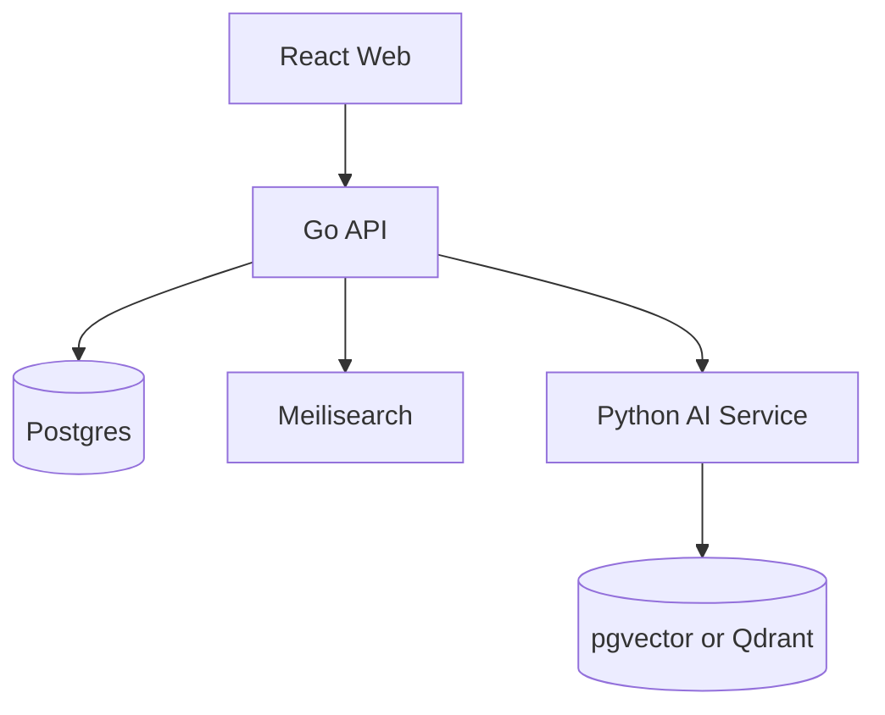
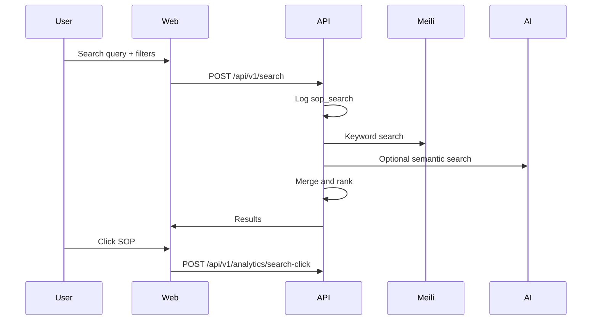
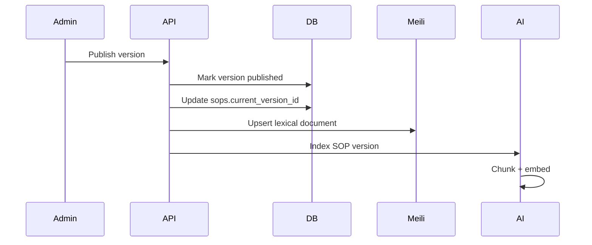

# 02. Architecture

## High-Level System

## Service Responsibilities

| Service | Responsibilities |
| --- | --- |
| React Web | Search UI, SOP detail, admin workflow, dashboards, RBAC-based navigation |
| Go API | Auth/RBAC, SOP CRUD, version workflow, taxonomy, search orchestration, analytics, audit, AI client |
| Python AI | Chunking, embeddings, semantic search, query normalization, suggestions, grounded summaries |
| Postgres | System of record for users, SOPs, versions, sections, taxonomy, events, and audit logs |
| Meilisearch | Keyword search, filters, synonyms/aliases, recent/popular ranking support |
| pgvector/Qdrant | Semantic retrieval over approved SOP chunks |

## Search Flow

## Publish Flow

## MVP Deployment

Docker Compose is the default local deployment:

- `web` on port `3000`.
- `api` on port `8080`.
- `ai` on port `8090`.
- `postgres` on port `5432`.
- `meilisearch` on port `7700`.
- `qdrant` on port `6333`.

Production can move the same service boundaries to Kubernetes or the internal platform.
