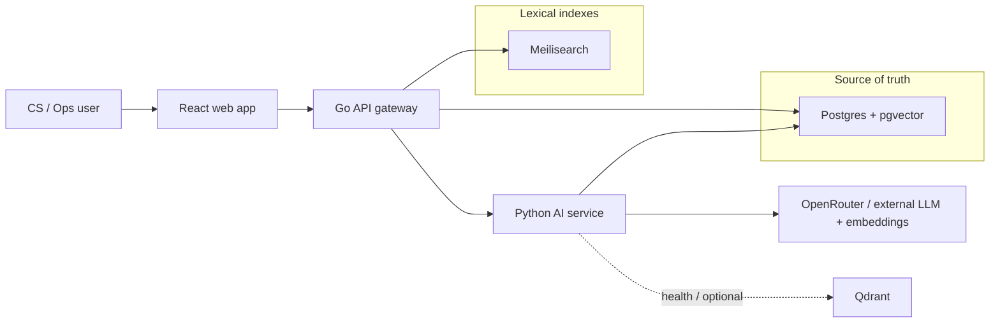
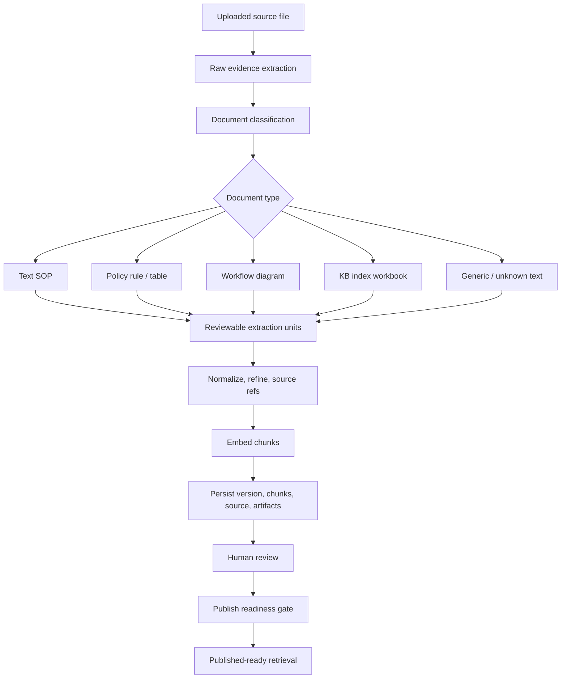
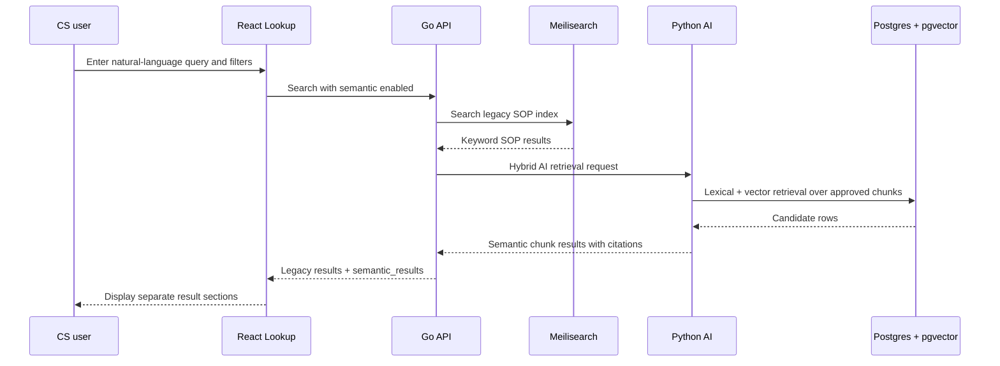
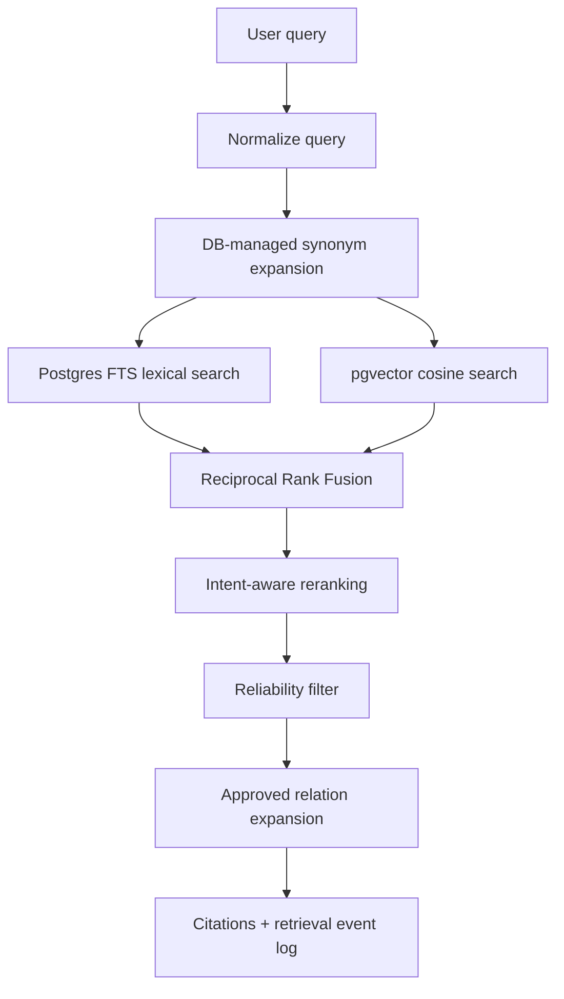
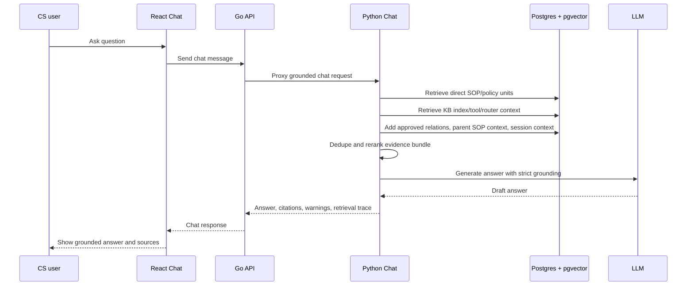

# CS KB MVP - Architecture Overview

This document describes the current workflow of the CS KB MVP system in the same high-level style as the BXT Ops-ai reference document. It covers the two main product flows:

- Ops creating, reviewing, publishing, and governing knowledge.
- CS users retrieving knowledge through lookup, case assist, and grounded chat.

It also calls out why this project is more accuracy-oriented than a simple collection-based RAG system.

## 1. Executive Comparison With BXT Ops-ai

The BXT Ops-ai PDF describes a collection-centric RAG system:

- Admin creates a collection.
- Admin uploads PDF, text, web URLs, or API data sources.
- Admin configures chunking, embedding model, and metadata extraction rules.
- The ingestion pipeline parses PDF/MD, embeds chunks, and stores them in Qdrant.
- User chat retrieves relevant chunks from a selected collection and sends them to an LLM with citations.

The CS KB MVP is a document/version-centric operational knowledge base:

- Ops uploads source files as evidence, not as automatically trusted answers.
- Python classifies each source document and branches into document-type-specific extraction.
- Source blocks, AI outputs, workflow graph artifacts, refinement reports, and publish-readiness reports are persisted for audit.
- Review units must pass human review and publish gates before they become production-visible.
- Retrieval uses Postgres full-text search, pgvector semantic search, DB-managed synonym expansion, Reciprocal Rank Fusion, intent reranking, reliability filtering, approved relation expansion, and citations.
- Go keeps legacy SOP lookup available through Meilisearch and Postgres fallback even when the Python AI service is unavailable.

### Which Project Is Stronger For Accuracy?

For parsing accuracy, the current CS KB MVP is stronger. The BXT document only describes generic ingestion into vector storage. The current project has source-aware parsing for PDF, DOCX, XLSX, text, workflow diagrams, and KB index workbooks. It preserves source refs, stores intermediate artifacts, uses deterministic extraction where possible, and blocks unsafe or degraded output until review.

For retrieval accuracy, the current CS KB MVP is also stronger for CS/Ops policy use cases. It combines lexical and vector retrieval, Vietnamese/accent-insensitive normalization, governed synonyms, metadata filters, publication gates, unit-type-aware reranking, and grounded chat rules. The BXT design can be simpler and potentially easier to scale semantically with Qdrant, but the PDF does not show hybrid ranking, review gates, synonym governance, relation expansion, or no-source safety behavior.

The BXT design is better for a lightweight, general-purpose RAG product. The current CS KB MVP is better for controlled operational knowledge where wrong answers, stale policy, or weak source trace are risky.

## 2. System In One Picture



Runtime ownership:

- React owns the product UI and operational workflows.
- Go owns the public API boundary, legacy SOP CRUD/search, Meilisearch indexing, and fallback behavior.
- Python owns extraction, embeddings, AI document lifecycle, pgvector retrieval, grounded chat, synonyms, relations, KB index materialization, and publish gates.
- Postgres is the source of truth for legacy SOPs, AI-ingested documents, versions, chunks, relations, chat, events, and governance config.
- Meilisearch accelerates lexical SOP/document lookup but is not the source of truth.
- Qdrant exists in infrastructure checks, but current production retrieval is implemented through Postgres + pgvector.

## 3. Key Components

| Component | Description |
| --- | --- |
| React Web | Web interface for lookup, chat, case assist, document review, publish, collections, tools, relations, synonyms, feedback, and retrieval lab. |
| Go API | Public backend gateway for the frontend. Handles legacy SOPs, Meilisearch sync, keyword fallback search, and proxies AI/document/governance calls to Python. |
| Python AI Service | Extraction, classification, structuring, workflow graph handling, embedding, pgvector retrieval, grounded chat, synonym governance, relation expansion, and publish gates. |
| Postgres + pgvector | Main system of record and semantic vector store. Stores current/published versions, chunks, embeddings, source refs, audit events, retrieval events, and config tables. |
| Meilisearch | Lexical search index for legacy SOPs and published AI document/chunk cards. Rebuilt from canonical data rather than treated as source truth. |
| OpenRouter / LLM Service | Used for AI structuring, workflow interpretation, refinement, metadata suggestions, embeddings when configured, and chat generation. |
| Domain Config Tables | Taxonomy terms, extraction signals, rerank rules, sheet mapping rules, relation patterns, display labels, and synonym groups. |

## 4. Ops Flow: Create And Publish Knowledge

### Step 1: Login And Access Workspace

Ops users open the web app and navigate to Documents, Collections, Relations, Synonyms, Retrieval Lab, or Feedback depending on the task.

### Step 2: Define Metadata

For uploaded knowledge, Ops provides metadata such as:

- external id;
- title;
- audience;
- vertical;
- category;
- tags;
- case reasons;
- owner team;
- risk level;
- effective date;
- review schedule;
- source marker.

This metadata is not cosmetic. It is later used by filters, reranking, governance, publish readiness, and source display.

### Step 3: Upload Data Sources

Supported source types include:

- PDF documents;
- DOCX documents;
- XLSX/XLSM/XLS spreadsheets;
- TXT and Markdown text;
- image-like assets as draft/manual-curation inputs.

The current project does not treat web URLs and API endpoints as first-class ingestion sources in the same way as the BXT document. Its strongest path is governed upload of files that can be reviewed and versioned.

### Step 4: Extract And Structure

Go does not parse files. It proxies upload requests to Python.

Python runs the ingestion pipeline:

1. Extract raw evidence.
2. Classify document type.
3. Branch into document-type-specific parsing.
4. Structure content into reviewable units.
5. Normalize source refs and metadata.
6. Embed chunks.
7. Persist the version, chunks, source bytes, and pipeline artifacts.

### Step 5: Review And Curate

Ops reviews extraction units before publish:

- approve, reject, or edit units;
- fix headings/content/unit type/source refs;
- acknowledge page-only PDF source refs when required;
- manually curate degraded candidates;
- inspect pipeline artifacts when parsing is wrong.

Draft units can be edited. Published and archived versions are immutable.

### Step 6: Publish And Index

Publishing is a governed transition:

1. Python checks hard publish gates.
2. Python archives previous published versions for the same document.
3. Python marks the new version as published and indexing pending.
4. Go indexes document and chunk cards into Meilisearch.
5. Go reports indexing status back to Python.
6. Python marks the version `published_ready` only when the version is safe and indexed.

Production retrieval only reads current, active, published-ready versions with approved, structured or manually curated chunks.

## 5. Document Ingestion Pipeline



### Raw Evidence Extraction

Python preserves source structure where available:

- spreadsheets preserve sheets, rows, columns, and hyperlinks;
- DOCX preserves paragraphs, lists, headings, and tables;
- PDFs preserve extracted page text and, for workflow diagrams, rendered page images and visual layout candidates;
- text and Markdown are normalized and chunked;
- images become draft/manual-curation evidence when OCR or vision extraction is not available.

The pipeline stores `map/source_blocks` so reviewers can inspect what the parser actually saw.

### Classification

The service classifies documents into types such as:

- `text_sop`;
- `policy_rule`;
- `policy_table`;
- `workflow_diagram`;
- `kb_index_workbook`;
- `asset_sop`;
- `macro_script`;
- `training_material`;
- `unknown`.

Classification controls the extraction strategy. A workflow PDF, policy DOCX, and KB index spreadsheet do not follow the same path.

### Policy Rule And Policy Table

When source structure is strong, the service prefers deterministic extraction, especially for DOCX tables and spreadsheet-like policy matrices. If deterministic extraction is insufficient, Python can call an LLM for rule-table extraction, then normalizes the output into review units.

Typical units:

- `full_sop`;
- `policy_rule`;
- `exception_rule`;
- `warning`;
- `operational_note`;
- `related_document`.

### Workflow Diagram

Workflow diagrams are treated as high-risk because topology errors can create wrong operational instructions.

For PDF workflows, Python can:

- render pages into images;
- extract visual layout blocks and graph candidates;
- build semantic workflow refinement;
- run Workflow V3 graph-primary extraction;
- compile and repair graph candidates deterministically;
- validate step coverage, decision branches, terminal edges, source refs, annotation attachment, and graph integrity;
- fall back to V2 vision-primary, legacy workflow extraction, or degraded semantic candidates when needed.

Workflow topology is never auto-trusted. Human review is mandatory before production visibility.

### KB Index Workbook

KB index spreadsheets are not just searchable text. They can materialize navigation primitives after review:

- collections;
- issue router units;
- SOP references;
- tool links;
- action templates;
- VIP overlays;
- product update notes;
- relations and unresolved targets.

On publish, approved units can become first-class records in tables such as `kb_collections`, `kb_collection_items`, `tool_links`, and `action_templates`.

### Fallback And Safety

The pipeline is designed to fail recoverably:

- AI structuring failure can still produce a draft record.
- Empty or unreliable extraction can create degraded review candidates.
- Degraded units are publish-blocked until manually curated.
- Warnings and errors are persisted in metadata and pipeline artifacts.

The system prefers a blocked draft over an unsafe CS-facing answer.

## 6. Parsing Accuracy Model

The current project improves parsing accuracy through several layers:

| Accuracy Mechanism | Why It Matters |
| --- | --- |
| Source-aware parsing | PDF, DOCX, spreadsheet, and text sources preserve different evidence structures instead of being flattened blindly. |
| Document-type branching | Workflow diagrams, policy tables, and KB index workbooks receive specialized extraction logic. |
| Deterministic extraction first | Strong table or workbook structure can be extracted without relying fully on an LLM. |
| AI output normalization | Pydantic schemas and post-processing turn messy model output into predictable internal units. |
| Source refs | Units carry source trace such as page, row, table, heading path, or source file. |
| Pipeline artifacts | Reviewers can debug map, classify, visual graph, AI breakdown, refinement, and verification stages. |
| Publish gates | Draft, failed, degraded, unreviewed, source-weak, or publish-blocked chunks cannot appear in production retrieval. |

Known parsing limitations:

- PDF extraction quality depends on text layer quality and visual rendering support.
- Workflow graph semantics can still require manual correction.
- Image OCR/vision extraction is not a fully trusted local path.
- LLM structuring can vary, so review and artifact inspection remain required.
- Page-only PDF refs are weaker than bbox or cell-level refs and require acknowledgement.

## 7. User Flow: Lookup Search



Go returns two result groups:

- `results`: legacy structured SOP keyword results;
- `semantic_results`: AI-ingested document chunk matches.

Go currently does not fuse these into one global ranked list. This keeps fallback behavior simple and keeps legacy SOP lookup available if Python AI retrieval is down.

## 8. AI Retrieval Pipeline



Retrieval modes:

- `lexical`: Postgres full-text search with accent-insensitive normalization.
- `vector`: pgvector cosine search over chunk embeddings.
- `hybrid`: lexical and vector candidates merged through Reciprocal Rank Fusion.

The default embedding dimension is `1536`. Remote embeddings can use OpenRouter-compatible providers. Local `local_hash` embeddings keep development and tests running without external dependencies, but they are not intended as the final high-quality semantic model.

## 9. Retrieval Accuracy Model

The current project improves retrieval accuracy through:

| Accuracy Mechanism | Why It Matters |
| --- | --- |
| Hybrid lexical + vector search | Exact operational terms and semantic paraphrases both have a path to match. |
| Accent-insensitive Vietnamese matching | Vietnamese queries can match normalized source content and synonyms. |
| DB-managed synonyms | Ops can govern query expansion without changing code or prompts. |
| Metadata filters | Audience, vertical, category, tags, case reasons, collections, task types, and unit types narrow the search space. |
| Reciprocal Rank Fusion | Lexical and vector scores do not need to be directly comparable. |
| Intent reranking | Action-oriented units such as policy rules, workflow steps, warnings, tool links, and router units can be boosted when relevant. |
| Reliability filter | Weak vector-only matches can be dropped and surfaced as `no_reliable_source`. |
| Approved relation expansion | Retrieval can add related SOPs only through reviewed relations. |
| Production gates | Draft, archived, failed, unreviewed, degraded, stale, or publish-blocked chunks are excluded. |
| Retrieval events | Queries, filters, mode, result count, and latency are logged for analysis. |

Known retrieval limitations:

- Legacy SOP results and AI semantic results are returned separately, not globally fused.
- Semantic quality depends on the configured embedding provider.
- Local hash embeddings are useful for development but weak for production semantic similarity.
- Meilisearch indexing failure keeps a published version from becoming `published_ready`.
- Golden query evaluation is still needed for every important SOP/workflow after publish.

## 10. User Flow: Grounded Chat



Chat does not simply summarize the first retrieved chunks. It builds a wider evidence bundle:

- direct SOP and policy units;
- KB index units such as issue routers, tool links, and action templates;
- approved relation targets;
- parent full-SOP context;
- recent session context;
- semantic dedupe and chat-stage reranking.

A grounded policy answer requires at least one direct or related policy source. If retrieval finds only index/tool/navigation context, the system warns instead of pretending it has policy evidence.

## 11. Data Model Summary

The project has two knowledge domains.

### Legacy Structured SOPs

Owned mostly by Go:

- `kb_sops`;
- `kb_sop_versions`.

Search path:

```txt
React Lookup
  -> Go Search
    -> Meilisearch index "sops"
    -> Postgres fallback scoring if Meilisearch fails
```

### AI-Ingested Documents

Owned mostly by Python:

- `ai_documents`;
- `ai_document_versions`;
- `ai_chunks`;
- `ai_document_sources`;
- `extraction_jobs`;
- `extraction_stage_outputs`;
- `ai_document_relations`;
- `ai_retrieval_events`;
- `ai_chat_events`;
- `ai_chat_sessions`;
- `ai_chat_messages`;
- `ai_audit_events`;
- KB index tables such as `kb_collections`, `kb_collection_items`, `tool_links`, and `action_templates`;
- governance tables such as taxonomy, synonyms, extraction signals, rerank rules, relation patterns, sheet mapping rules, and display labels.

Production retrieval requires:

- document status is active;
- version is current;
- version status is published;
- version publish state is `published_ready`;
- chunk review status is approved;
- chunk extraction status is `structured` or `manually_curated`;
- chunk is not publish-blocked.

## 12. Notes And Limitations

| Item | Current State |
| --- | --- |
| Maximum file size | Enforced by `settings.max_upload_bytes`; exact deployment value depends on environment config. |
| Supported source types | PDF, DOCX, XLSX/XLSM/XLS, TXT, Markdown, and image-like assets as draft/manual-curation evidence. |
| Supported languages | Vietnamese and English are both supported in parsing/retrieval signals, with Vietnamese-specific normalization and domain defaults. |
| Vector database | Postgres + pgvector is the current retrieval store. Qdrant is present but not the active retrieval path. |
| Lexical search | Meilisearch for legacy/public index cards; Postgres FTS for AI chunk retrieval. |
| Response latency target | Not fixed in this doc. Retrieval and chat should be measured with real golden query and chat workloads. |
| URL/API ingestion | Described in the BXT PDF, but not the strongest/current governed ingestion path in this project. |
| Safety posture | No production answer from draft, unreviewed, degraded, stale, or publish-blocked knowledge. |

## 13. Practical Takeaway

If the goal is a fast generic RAG chatbot, the BXT collection model is simpler. If the goal is accurate CS/Ops policy retrieval where source trace, review state, current version, Vietnamese phrasing, and operational governance matter, the current CS KB MVP architecture is stronger.

The main cost of the current architecture is complexity. The main benefit is that accuracy is not delegated to embeddings alone. Parsing, review, publication, retrieval, reranking, relations, and chat grounding all participate in preventing unsafe or stale answers.
