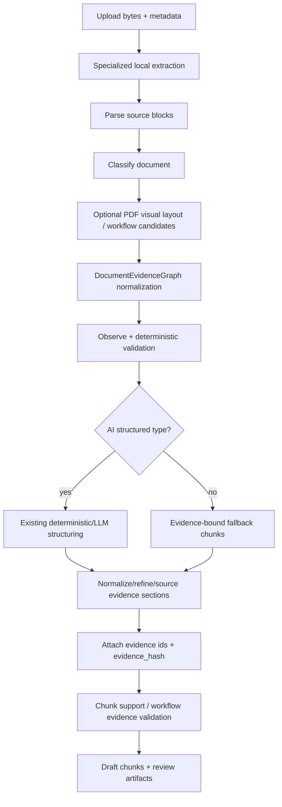

# Evidence-First Ingestion Audit

## Current Flow

The production upload path still enters through `apps/cs-kb-ai/app/ingestion.py::prepare_document_version`.

## What Was Weak

- Non-AI fallback previously used raw `chunk_text(raw_text)` as the source of chunks. That was text-centric and did not require source element IDs.
- Source refs existed in many specialized paths, but there was no shared IR tying DOCX paragraphs, spreadsheet cells, Markdown line spans, PDF page elements, and workflow visual primitives into one evidence model.
- Validation was mostly chunk-metadata based. It could block missing source refs for known workflow/policy cases, but it could not consistently detect unsupported semantic units across all file types.
- Parser disagreement and workflow edge evidence were not represented as first-class graph evidence.
- Review artifacts focused on source blocks and AI outputs, not a normalized evidence graph that downstream review tools can inspect.

## New Architecture

The new evidence-first layer is additive:

- `app/ir/schema.py` defines `DocumentArtifact`, `Container`, `SourceElement`, `Relation`, `SemanticUnit`, `EvidenceChunk`, and `DocumentEvidenceGraph`.
- `app/ir/document_evidence_graph.py` adapts current extractor outputs into graph evidence:
  - plain text lines
  - Markdown heading/line spans
  - DOCX block elements
  - spreadsheet sheets, rows, and cells
  - PDF workflow graph nodes and edges where visual layout candidates exist
- `app/reasoning/*` contains deterministic observe/extract/adjudicate/verify passes plus prompt templates for future LLM passes.
- `app/validators/*` adds evidence coverage, chunk support, workflow edge evidence, table, chart, spreadsheet, and parser disagreement validators.
- `app/chunking/evidence_bound_chunker.py` builds fallback chunks from evidence and attaches `source_element_ids` and `evidence_hash` to legacy chunks from existing paths.
- `app/review/review_artifacts.py` serializes the graph/profile/validation reports as pipeline artifacts.

`app/ingestion.py` remains the compatibility orchestrator because replacing it with an `app/ingestion/` package would break the existing import path `from app.ingestion import prepare_document_version`.

## Production Gates Added

Every non-source-evidence draft chunk now gets:

- `source_element_ids`
- `evidence_hash`
- `publish_eligible`
- `validation_status`
- `blocked_reasons`

Publish blocking now includes evidence validation blockers in addition to degraded extraction status. Workflow diagrams also run graph edge evidence validation so unresolved or ungrounded edges can block publish.

## File-Type Handling

- PDF: existing text and visual layout extraction are preserved. Visual graph candidates become `graph_node` and `graph_edge` evidence elements.
- DOCX: existing block/table extraction is preserved and normalized into paragraph/table elements where available.
- XLSX/Excel: workbook rows and cells become sheet-scoped evidence elements with row/cell locators.
- Markdown: line-based AST-style sections preserve heading hierarchy and source line spans.
- Plain text: line elements become the evidence source for fallback chunks.

## Migration Notes

- Existing deterministic and AI structuring paths still run. The new graph layer surrounds them rather than replacing them.
- New fallback chunks are generated by `legacy_chunks_from_evidence(...)`, not by blind raw-text token chunking.
- Existing chunks from AI/deterministic paths are post-processed by `attach_evidence_metadata_to_legacy_chunks(...)`.
- Source evidence sections remain display-only and are not forced into production retrieval.
- Downstream storage remains compatible because emitted draft units are still legacy `Chunk` objects.

## Remaining Risks

- The graph IR currently normalizes available local evidence. It does not yet call an external oracle parser or multimodal parser as a separate extractor.
- Table validators are scaffolded and detect missing header verification, but full rowspan/colspan consistency and cross-page table continuation checks still need richer table IR from the extractor.
- Chart datapoint support is schema/validator ready, but chart extraction needs a dedicated parser.
- Workflow edge validation can require page+bbox edge evidence, but visual connector precision still depends on the current PDF visual extraction quality.
- Parser disagreement is represented, but only explicit unresolved disagreement metadata is blocked today.

## Test Coverage Added

- Text evidence graph line source elements.
- Non-AI fallback chunks have source evidence and hashes.
- Unsupported semantic units are blocked.
- Workflow graph edges require edge-level source evidence.
- Spreadsheet chunks cite sheet/row/cell locators.
- Markdown chunks preserve heading hierarchy and line spans.
- Chunk support validator blocks chunks missing evidence.
